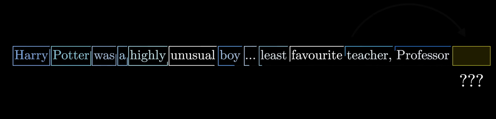
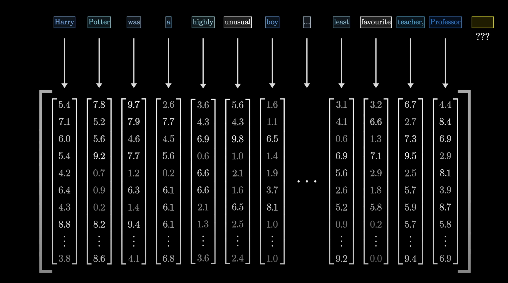

# miniGPT
**Goal:** Build a Transformer (GPT) from scratch

Extra resources to help out:

[Let's build GPT: from scratch, in code, spelled out - Andrej Karpathy](https://www.youtube.com/watch?v=kCc8FmEb1nY)

[Attention Is All You Need](https://arxiv.org/abs/1706.03762)

[How Transformer LLMs Work - DeepLearning.AI course](https://www.deeplearning.ai/short-courses/how-transformer-llms-work/?utm_campaign=handsonllm-launch&utm_medium=partner)

# Transformers: 
[Simple video](https://www.youtube.com/watch?v=wjZofJX0v4M)

 **Transformers** are a type of deep neutal network, that takes a sequence of data (such as text), understands how each element in the sequence relates to the others and predicts what comes next.

In large language models (LLMs), a transformer understands how words in a sentence relate to each other so it can capture meaning and generate the next word.

The model does this by embedding each input token into a vector that captures its meaning and send it to the transformer block.

#### Example:

Let’s say our vocabulary has three words: **["king", "queen", "apple"]**

$$
E =
\begin{bmatrix}
0.82 & 0.14 & 0.56 & 0.33 \\\\
0.80 & 0.18 & 0.60 & 0.35 \\\\
0.10 & 0.90 & 0.12 & 0.85
\end{bmatrix},
\quad
t_{king} =
\begin{bmatrix}
1 \\\\
0 \\\\
0
\end{bmatrix}
$$

Then the embedding for **"king"** is:

$$
x_{king} = E \cdot t_{king} =
\begin{bmatrix}
0.82 \\\\
0.14 \\\\
0.56 \\\\
0.33
\end{bmatrix}
$$

The transformer blocks, decides which words are most relevant to each other (Self-Attention layer) and then refines and transform the information (Feedfoward Neural Network).

The final output vector are passed to a language modeling head which predicts the next token. 

# Applying:

**Input** : Tiny shakespear