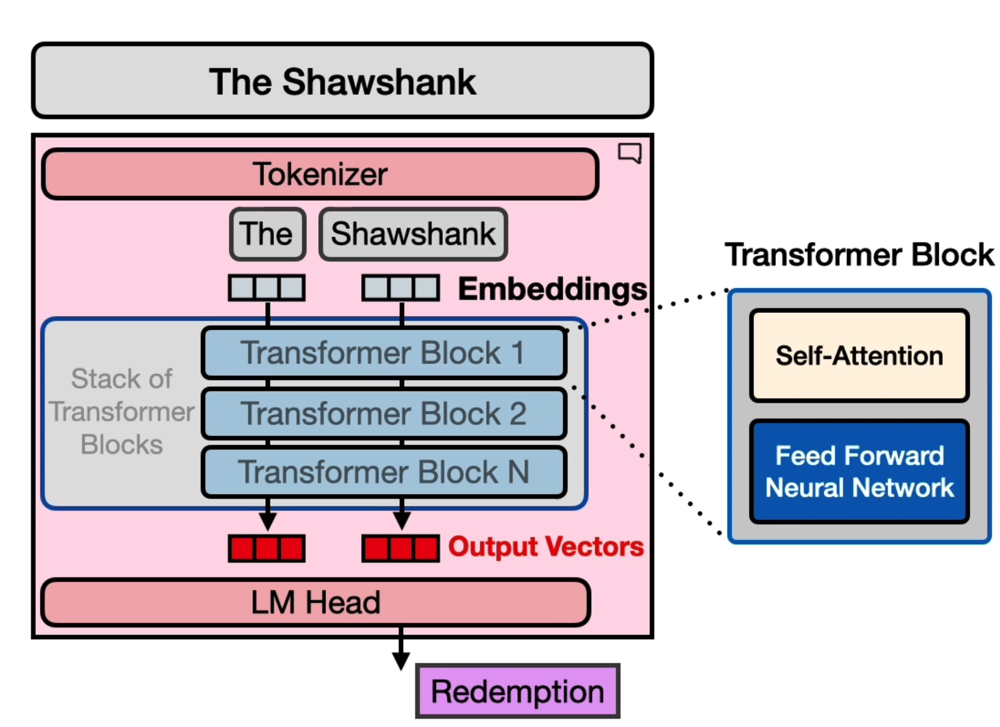
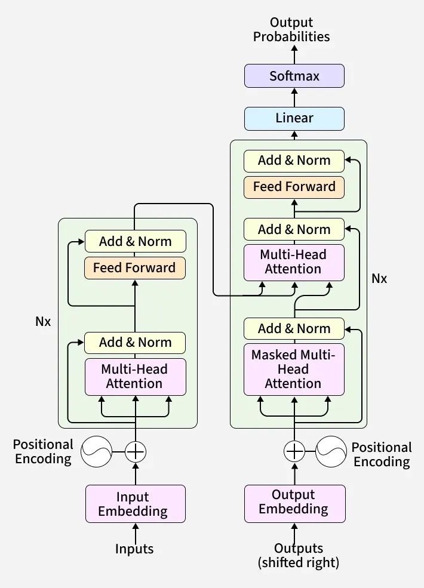

# miniGPT
**Goal:** Build a Transformer (GPT) from scratch

Extra resources to help out:

[Let's build GPT: from scratch, in code, spelled out - Andrej Karpathy](https://www.youtube.com/watch?v=kCc8FmEb1nY)

[Attention Is All You Need](https://arxiv.org/abs/1706.03762)

[How Transformer LLMs Work - DeepLearning.AI course](https://www.deeplearning.ai/short-courses/how-transformer-llms-work/?utm_campaign=handsonllm-launch&utm_medium=partner)

# Transformers: 
[Simple video](https://www.youtube.com/watch?v=wjZofJX0v4M)

 **Transformers** are a type of deep neural network that takes a sequence of data (such as text), understands how each element in the sequence relates to the others and predicts what comes next.

### How it works

In large language models (LLMs), a transformer understands how words in a sentence relate to each other so it can capture meaning and generate the next word.

> **"The cat sat ..."**

The model does this by separating the sentence into small sections called **tokens**. Then we embed each input token into a vector (a list of numbers) that captures its meaning.

$$
E =
\begin{bmatrix}
0.2 & 0.4 & 0.1 \\\\
0.6 & 0.1 & 0.8 \\\\
0.9 & 0.7 & 0.3
\end{bmatrix}
$$

#### Transformer Block

The transformer blocks, decides which words are most relevant to each other (Self-Attention layer) and then refines and transform the information (Feedfoward Neural Network).

##### Self Attention

Each word creates three versions of itself:  
- **Query (Q):** What it’s looking for  
- **Key (K):** What it offers  
- **Value (V):** Its meaning  

$$
Q = XW_Q, \quad K = XW_K, \quad V = XW_V
$$

Then, every word compares its **Query** with every other **Key**:

$$
\text{Scores} = QK^T
$$

Higher scores mean the words are more related.  
We scale and apply **softmax** so the values act like attention weights:

$$
\text{Attention} = \text{softmax}\!\left(\frac{QK^T}{\sqrt{d_k}}\right)
$$

Finally, each word mixes the information from all others using these weights:

$$
\text{Output} = \text{Attention} \times V
$$

So “king” gives more attention to “queen” than “apple,” updating its meaning with relevant context 

#### Feedforward Neural Network + Normalize

After **Self-Attention**, each word’s vector now contains context.  

The **Feedforward Layer** helps the model process that information more deeply using a small two-layer network:

$$
\text{FFN}(x) = \text{ReLU}(xW_1 + b_1)W_2 + b_2
$$

Then, the model adds the original input back to the output (a **residual connection**) and **normalizes** it for stability:

$$
\text{Output} = \text{LayerNorm}(x + \text{FFN}(x))
$$

### Language Modeling Head
After the transformer finishes processing,  
each word has a final **vector** that captures its full meaning and context.  
Now the model needs to turn those vectors into actual **predicted words**.

Each word is now just a list of numbers (a vector) — for example:

| Word | Vector (example) |
|:-----|:----------------:|
| The  | [0.23, -0.11, 0.77, 0.52, ...] |
| king | [0.45, 0.84, -0.31, 0.09, ...] |

These vectors are the **input** to the language modeling head.

---

#### ⚙️ What happens next

The model multiplies these vectors by a large **vocabulary matrix**  
(one row for every possible word it can predict).  
This gives a **score** for each possible next word.

Then it uses **softmax** to turn those scores into **probabilities**  
that add up to 1.

---

#### 🗣️ Output Example

If the model just saw the phrase “The”, it might predict:

| Next Word | Probability |
|:-----------|:-------------:|
| king | 0.65 |
| cat  | 0.18 |
| apple | 0.06 |
| sat | 0.02 |

The word with the **highest probability** ("king") is chosen as the next word.

# Applying:

**Input** : Tiny shakespear
