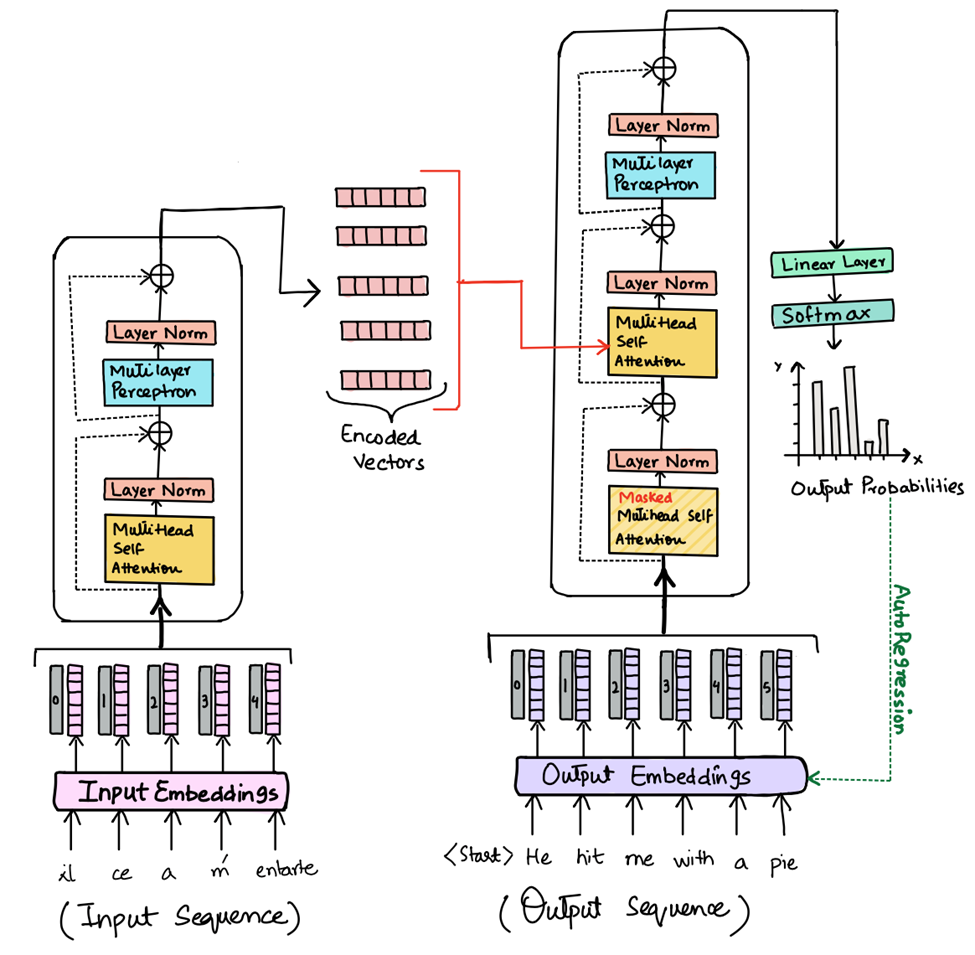
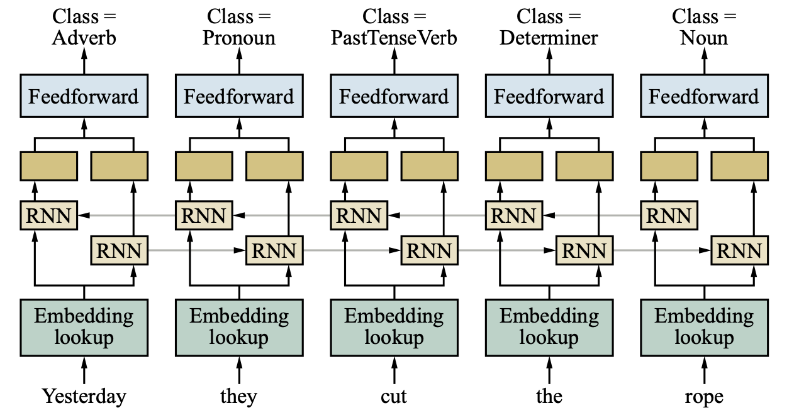
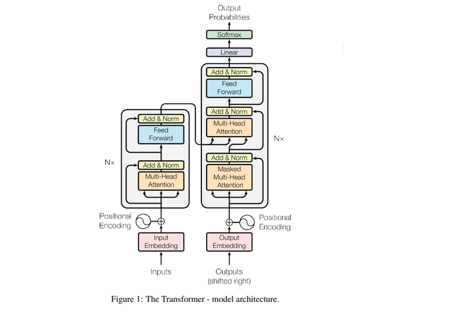
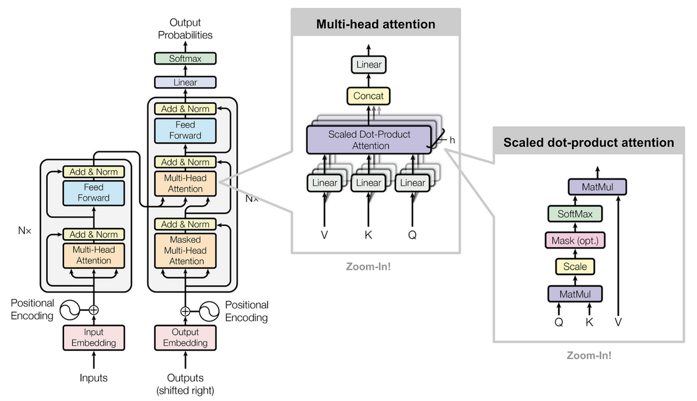
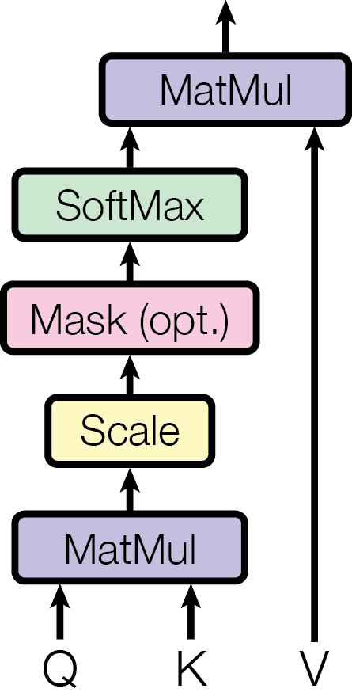

# Machine Translation with transformer model:
### [A reflective guide to "All You Need Is Attention" paper](https://arxiv.org/abs/1706.03762)


In 2017, the paper “Attention Is All You Need” fundamentally transformed the field of natural language processing by introducing the Transformer architecture. This breakthrough laid the foundation for the large language models that dominate today’s AI landscape.

Originally, the Transformer model was designed for machine translation, using an encoder–decoder architecture powered entirely by attention mechanisms. Although modern large language models have evolved into decoder-only architectures, the original Transformer remains the core foundation of nearly all current models.

In this project, I will break down and implement the key components of the Transformer architecture ([encoder](encoder_transformer/README.md) and [decoder](decoder_transformer/README.md))  presented in the paper, that now has shaped modern Artificial Intellignece as we know it.

<p align="center">
  
  <p align="center"><em>Machine translation with transformer atchitecture</em></p>
</p>

## 📚 Table of Contents

1. [What is a Transformer?](#what-is-a-transformer)
2. [Key concepts](#key-concepts)
3. [Model Architecture](#model-architecture)
4. [Encoder](#encoder-component-words---context)
5. [Decoder](#decoder-component-context---words)
6. [Project structure](#project-structure--implementation)
7. [Quick start guide](#quick-start-guide)

---

## What is a Transformer?

Before Tranformer, sequence transduction architectures (like machine translation) where based on complex recurrent (RNN) or convolutional (CNN) neural networks. These models where built off of [encoders](#encoder-component-words---context) and [decoders](#decoder-component-context---words) framework with limited [attention mechanisms](#key-concepts) to process language sequentially (one word at a time). 

<p align="center">
  
  <p align="center"><em>Recurrant Network for language processing</em></p>
</p>

However, these architectures was very hard to scale due their inherent sequencial nature that becomes critical for memory at longer sequence lengths.

This paper introduce the Transformer, relying entirely on an attention mechanisms that allows for significantly more parallelization called [self attention](#key-concepts).


<p align="center">
  
  <p align="center"><em>Transformer architecture</em></p>
</p>

With attention, the Transformeer model can directly relate every position to every other position. This allows the model to relate and "remember" all the words from beofre in a constant number of operations.


### Key Concepts

#### Attention

Although the Transformer architecture (described in the paper) is build around encoders and decoders, it is all based around the concept of the attention mechanism. 

It is crucial for someone to fully understand this concept before moving on if you want to fully grasp transformers models so here are some extra resources I found useful: [3Blue1Brown (most recommended)](https://www.youtube.com/watch?v=eMlx5fFNoYc), [Intro to transformers and attention](https://medium.com/@kalra.rakshit/introduction-to-transformers-and-attention-mechanisms-c29d252ea2c5), 

Else here is the main concept of it:

<p align="center">
  
  <p align="center"><em>Attention with Transformers</em></p>
</p>

**Attention Mechanism**: This is the core innovation that allows the model to focus on different parts of the input sequence when processing each element.

**Self-Attention**: A mechanism where each position in a sequence can attend to all positions in the same sequence to compute a representation.


**Multi-Head Attention**: Multiple attention mechanisms running in parallel, each learning different types of relationships between words.


**Scaled Dot-Product**: This is the mathematical implementation of a single attention head.




#### Embedding + Unembedding 

The transformer is only able to work if we are able to represent the human words into a way computers are able to understand: vectors. 

We are able to do this by embedding the words in a process that is called tokenization. We are able to understand the vectors relationships within a model with vector of dimensions. 

Once the process is done we then need to unembed the vectors to turn the vector into something humans can understand. 


#### Positional encoding

Since the model processes the sentence all at once, there is no recurrence or convolution. Thus we need to add positional encoding to the input of embeddings at the bottom of the encoder and decoder stacks. 


### Model architecture 


The transformer model can be seperated in 2 parts: `Encoder` (left box) and an `Decoder` (right box)


### Encoder Component (Words -> Context)
[For more detail go to encoder_transformer README](encoder_transformer/README.md)

**Purpose**: Processes the input sequence and creates rich contextual representations.

**Key Features**:
- **Self-Attention**: Each word attends to all other words in the input
- **Bidirectional Processing**: Can see both past and future context
- **Contextual Encoding**: Converts input tokens into meaningful vector representations

**Architecture**:
```
Input → Embedding → Multi-Head Self-Attention → Feed Forward → Output
```

**What it learns**:
- Grammatical relationships (subject-verb, adjective-noun)
- Semantic meaning and context
- Long-range dependencies between words

### Decoder Component (Context -> Words)
[For more detail go to decoder_transformer README](decoder_transformer/README.md)
**Purpose**: Generates output sequences based on encoder representations and previous outputs.

**Key Features**:
- **Masked Self-Attention**: Can only attend to previous positions (causal masking)
- **Cross-Attention**: Attends to encoder outputs for translation context
- **Autoregressive Generation**: Generates one token at a time

**Architecture**:
```
Input → Embedding → Masked Self-Attention → Cross-Attention → Feed Forward → Output
```

**What it learns**:
- Language generation patterns
- Translation mappings from source to target
- Sequential dependencies in output language


### How They Work Together

1. **Encoder** processes the source sentence (e.g., English)
2. **Decoder** uses encoder's context to generate target sentence (e.g., French)
3. **Cross-attention** allows decoder to focus on relevant parts of source
4. **Teacher Forcing** during training helps decoder learn correct patterns

---

## Project Structure & Implementation

This project is organized into three main components, each building upon the previous:

### Project Overview

```
Transformers/
├── encoder_transformer/     # Encoder implementation & MLM training
├── decoder_transformer/     # Decoder implementation & language modeling  
├── machine_translation/     # Full seq2seq system combining both
├── assets/                  # Visual diagrams and checkpoints
└── app.py                   # Production web interface
```


## Quick Start Guide

### Prerequisites

```bash
pip install torch torchvision torchaudio
pip install datasets pandas tqdm
pip install tokenizers
pip install gradio
```

### 1. Train the Encoder (MLM)

```bash
cd encoder_transformer/mlm
python train.py
```

This trains a masked language model on the sentence: *"This model create relationships between the words to learn what word is missing!"*

### 2. Train the Decoder (Language Model)

```bash
cd decoder_transformer
python training.py
```

This trains a GPT-style language model on text data.

### 3. Train Machine Translation

```bash
# First, prepare the data
python machine_translation/setup_data.py --dataset wmt14 --out_dir data/en_fr

# Then train the translation model
python machine_translation/train_mini.py --train_csv data/en_fr/train.csv --val_csv data/en_fr/test.csv
```

### 4. Launch Production Interface

```bash
python app.py
```


