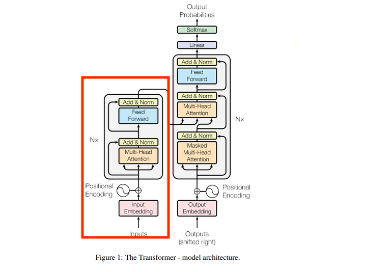
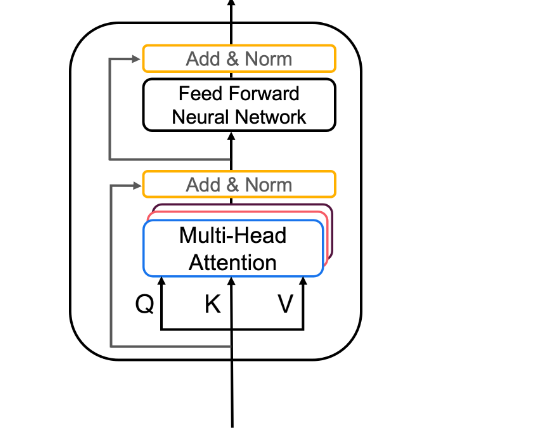
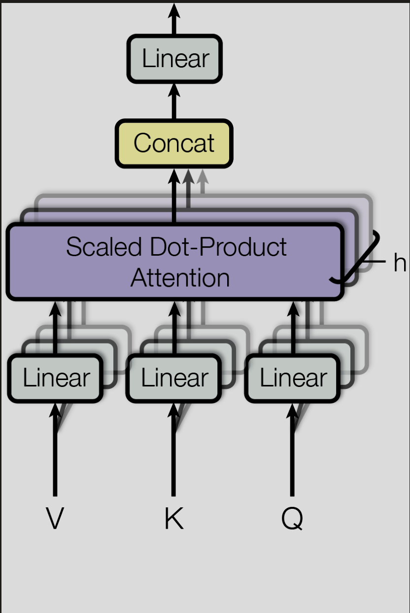

# Encoder for Machine Translation 

In this section we will be implementing the encoder and testing the encoder part of a transformer model.

</img>

The encoder converts sequence of English tokens into contextual vectors that capture meaning and long range dependencies. 

The Encoder consists of a stack of identical layers, where each layer has two sub-layers: a multi-head self-attention mechanism and a position-wise fully connected feedforward network.

</img>

### Input data

### Input Data Pipeline

1. **Tokenization**: Convert English text into token IDs (numbers)
   - Example: "The cat sat" → [101, 1996, 4937, 1045]

2. **Padding**: Make all sequences the same length for batch processing
   - Shorter sequences get padded with special [PAD] tokens (ID: 0)
   - Example: [101, 1996, 4937, 1045, 0, 0, 0]

3. **Attention Masks**: Tell the model which tokens are real vs padding
   - Real tokens: 1, Padding tokens: 0
   - Example: [1, 1, 1, 1, 0, 0, 0]

4. **Positional Embeddings**: Add learned position information to each token

###  Self attention: Multi-head self attention

Attention builds information onte token by creating query, key and Value for each token.

Q, K, V:
Q (Query) = what this word is looking for.
K (Key) = a tag that describes each word.
V (Value) = the information each word carries.


**Self attention** uses the information about the token (Q,K,V) to build relationships within the sentence. 

While **multi head attention** (scaled Dot product attention) builds multiple different types of relationships simutaneously. 

**Example**: For "The cat sat on the mat"
- Head 1: Links "cat" → "sat" (subject-verb relationship)
- Head 2: Links "sat" → "on" (verb-preposition relationship) 
- Head 3: Links "on" → "mat" (preposition-object relationship)
- Head 4: Links "the" → "cat" and "the" → "mat" (article relationships)
- etc ... 

</img>

$$
Multihead(V,K,Q)= Concat(head_1,...,head_h)W^O

$$
$$
    where: head_i= attention(QW^Q_i, KW^Q_i )
$$

- Make Q (what I’m looking for), K (my tag), V (my info)
- Compare Q to every K → relevance scores
- Scale scores, mask PAD keys, then softmax → focus weights
- Mix: weighted average of all V → the head output

### Layer 2: Feed foward

Simple per token Multi-Layered Perceptron used to transform/refine the representations.


### Residuals + layernorm

We the add a residual connection around each sub layers and followed by layer normalization. 

Residual: 
After ever sublayer in the encoder (MHA + FFN layers), we add attention output back into x.
$$
x = x + SelfAttention(LN(x))
$$
$$
x = x + FeedForward(LN(x))
$$

$x = LN(x)$ at the end of the encoder stack


## Implementation 

**[encode.py](/encoder_transformer/encode.py)** file walks through these exact steps showing how to implement this in code. 


**Masked Language Modeling** is a great way to test encoding models by masking some of the tokens in a sentece and training to predict what the masked word should be. 
This is what I imlpemented in **[mlm.py](/encoder_transformer/mlm.py)** file.

To train and test the Masked Language Model:

    1. **Prepare data**:
    ```bash
    python3 setupdata.py --dataset wikitext-2 --out_dir encoder_transformer/archive_mlm
    ```

    2. **Train the model**:
    ```bash
    python3 encoder_transformer/mlm.py --data_dir encoder_transformer/archive_mlm --epochs 3
    ```

    3. **Test only** (skip training):
    ```bash
    python3 encoder_transformer/mlm.py --data_dir encoder_transformer/archive_mlm --epochs 0
    ```

## 📁 File Structure

```
encoder_transformer/
├── README.md                    # This file - explains the encoder
├── encode.py                    # Main encoder architecture (shared)
└── mlm/                        # MLM training and testing
    ├── __init__.py             # Package marker
    ├── train.py                # Training script for MLM model
    ├── test.py                 # Testing script for trained model
    ├── data.py                 # Data preparation for training
    └── models/                 # Trained model weights
        └── production_model.pt # Trained MLM model (created after training)
```

## 🚀 Quick Start

1. **Train the model**: `python encoder_transformer/mlm/train.py`
2. **Test the model**: `python encoder_transformer/mlm/test.py`
3. **Use in production**: The trained model is automatically loaded by the main app

